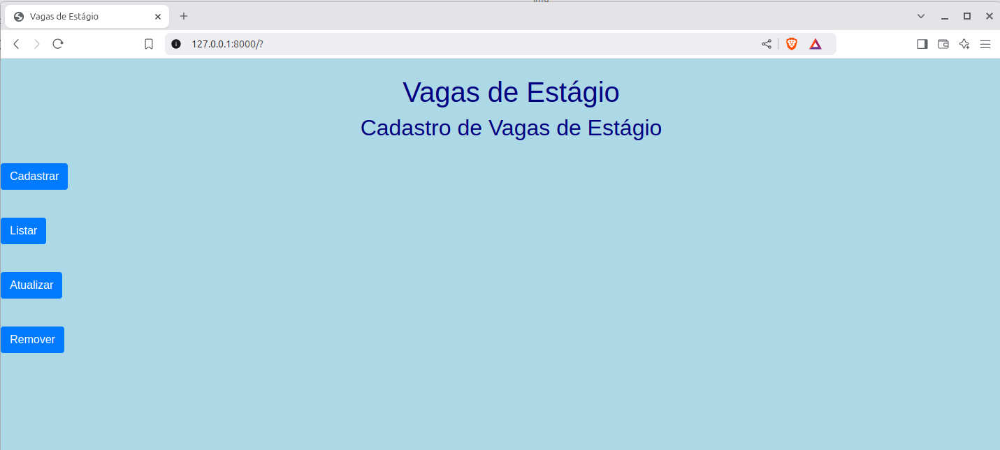
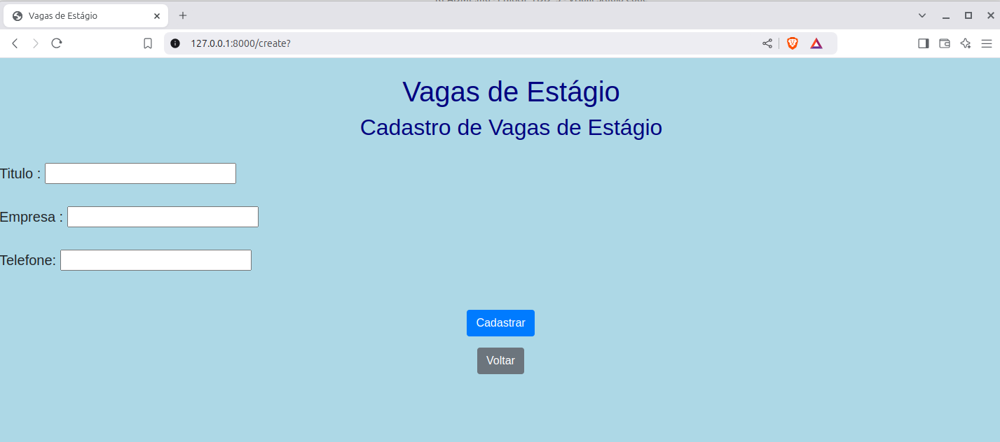
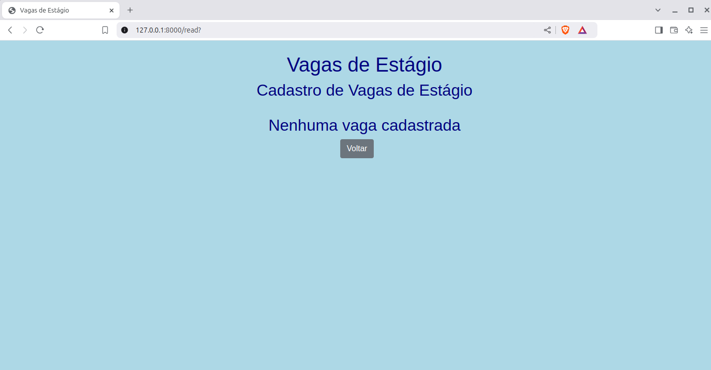
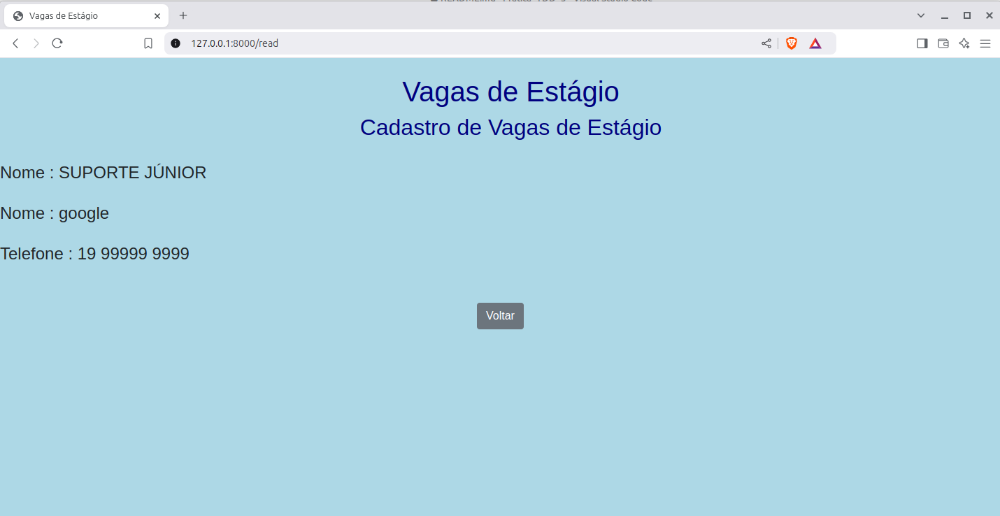
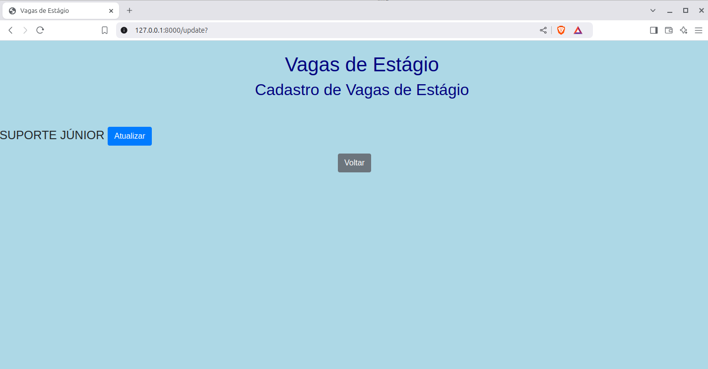
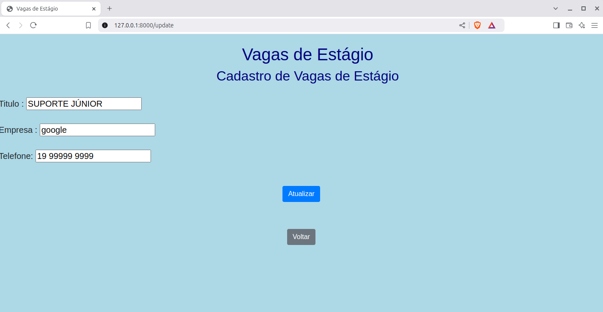
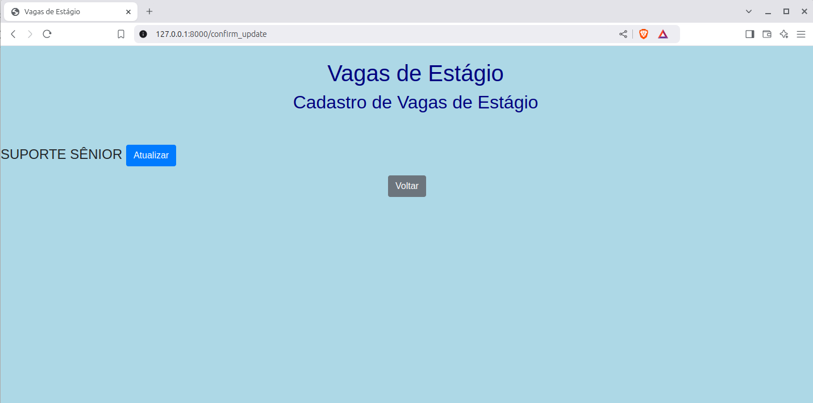
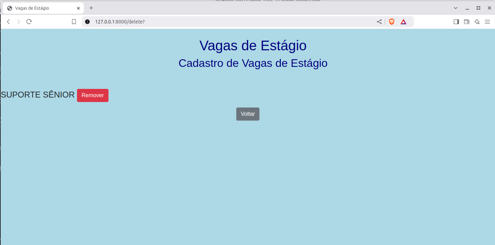

# Prática TDD

Desafio técnico aplicado na SECCOMP 2025


No ambiente Linux:

```console
git clone https://github.com/orlandosaraivajr/Seccomp-Rio-Claro-2025.git
cd Seccomp-Rio-Claro-2025/
python3 -m virtualenv venv
source venv/bin/activate
pip install -r requirements.txt
cd estagios/
python manage.py migrate
python manage.py test
coverage run --source='.' manage.py test 
coverage html
python manage.py runserver
```

No ambiente Windows:

```console
git clone https://github.com/orlandosaraivajr/Seccomp-Rio-Claro-2025.git
cd Seccomp-Rio-Claro-2025/
virtualenv venv
cd venv
cd scripts
activate.bat
cd ..
cd ..
pip install -r requirements.txt
cd estagios/
python manage.py migrate
python manage.py test
coverage run --source='.' manage.py test 
coverage html
python manage.py runserver

```

### Sprint 1

O projeto apresenta um cadastro de vagas de estágio. 

Na rota index (/index), se apresenta quatro botões, conforme imagem abaixo:


Ao acessar a rota cadastro (/create), é possível cadastrar o contato, que armazena as seguintes informações:

- Título
- Empresa
- Telefone



Ao acessar a rota read (/read), Nenhum contato está cadastrado:


Após cadastrar uma vaga, rota listar (/read), lista todas as vagas cadastradas:



Ao acessar a rota update (/update), é possível selecionar e atualizar uma vaga:





Ao acessar a rota delete (/delete), é possível remover um contato:



